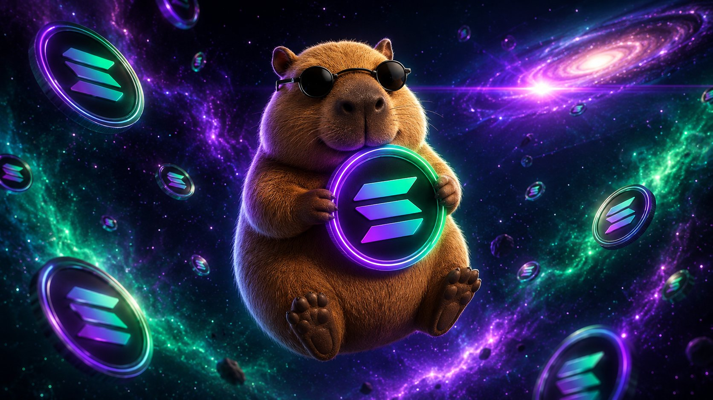

# $CAPYONSOL

> *The chillest capybara on Solana. He doesn't panic. He doesn't sell. He holds.*

---

## What is $CAPYONSOL?

$CAPYONSOL is a community-driven memecoin on the Solana blockchain, 
built around the world's chillest capybara mascot. While the market 
panics, $CAPYONSOL holds. While others sell, $CAPYONSOL holds. 
That's the whole strategy.

**No VC. No presale. No private rounds. Fair launch on pump.fun.**

---

## 🌐 Links

| | |
|---|---|
| **Website** | [capyonsolana.com](https://capyonsolana.com) |
| **Twitter/X** | [@capyonsolcoin](https://x.com/capyonsolcoin) |
| **Chain** | Solana |
| **Ticker** | $CAPYONSOL |
| **Status** | Pre-launch |

---

## 📁 This Repository

This is the official source code for the 
[capyonsolana.com](https://capyonsolana.com) website.

Built with:
- HTML + CSS + JavaScript
- GSAP for scroll animations
- Hosted on GitHub Pages

---

## ⚠️ Disclaimer

$CAPYONSOL is a memecoin created for entertainment and community 
purposes only. It has no intrinsic value and no expectation of 
financial return. This is not financial advice. Cryptocurrency 
investments are highly volatile — you can lose your entire 
investment. Do your own research. The capybara is not responsible 
for your portfolio.

---

*Made with chill. 🟣🟢*